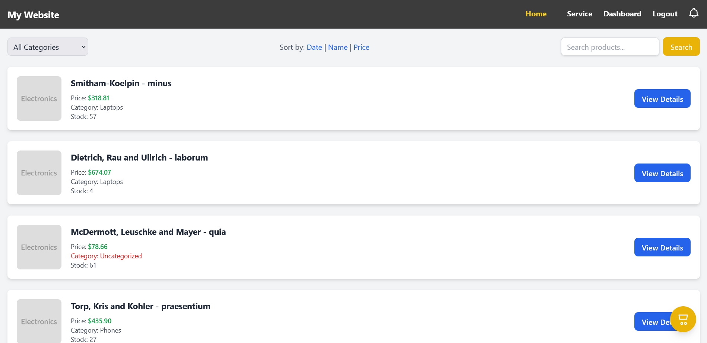
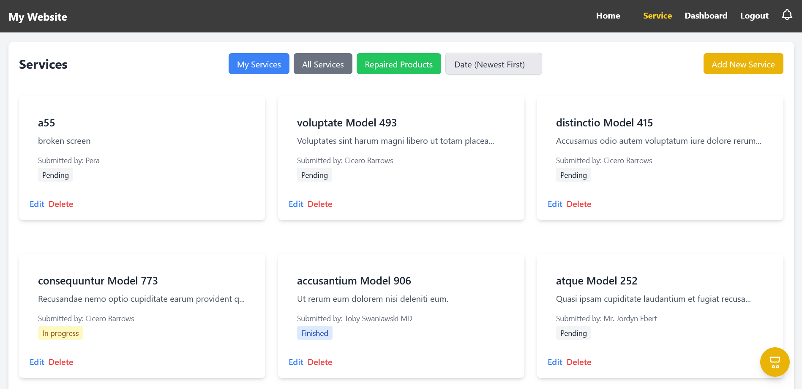

# 🛒 E-Commerce Web Application

This is a full-stack e-commerce web application built with **Laravel**, **TailwindCSS**, and **Blade components**.  
It allows users to browse products, manage a shopping cart, place orders, and administrators to manage products, services, and view dashboards.

---

## ✨ Features

- User authentication (register, login, logout)
- Product listing, details, and search
- Shopping cart & checkout
- Order history & PDF report generation
- Admin dashboard
- Admin CRUD for products and services
- Notifications

---

## 🖥️ Tech Stack

- **Backend:** Laravel
- **Frontend:** Blade templates + TailwindCSS
- **Database:** SQlite
- **Package Managers:** Composer & npm

---

## 🚀 Installation & Setup

### Prerequisites
✅ PHP (added to system variables)  
✅ Composer  
✅ Node.js & npm  

> 💡 *Tip: You can also use [Laravel Herd](https://herd.laravel.com/) if PHP is not configured globally.*

---

### Steps

```bash
# 1️⃣ Clone the repository
git clone https://github.com/BogdanRadivojevic/E-commerce.git
cd E-commerce

# 2️⃣ Copy environment file and generate app key
cp .env.example .env
php artisan key:generate

# 3️⃣ Install PHP dependencies
composer install

# 4️⃣ Install frontend dependencies
npm install

# 5️⃣ Run database migrations
php artisan migrate

# (Optional) Seed fake data into the database
php artisan db:seed

# 6️⃣ Create storage symlink so uploaded files are accessible
php artisan storage:link

# 7️⃣ Build frontend assets
npm run build

# 8️⃣ Start the Laravel development server
php artisan serve
```

## 📸 Screenshots

Here are some example screenshots of the app:

- Home page:  
  

- Cart page:  
  

- Service page:  
  

- Admin dashboard:  
  

- Complete orders:
  

- Login page:  
  

- Register page:  
  

## 👤 Author
<h1>Bogdan Radivojević</h1>

[](mailto:radivojevic.bogdan1@gmail.com)  
[](https://github.com/BogdanRadivojevic)  
[](https://www.linkedin.com/in/bogdan-radivojevi%C4%87-4678a6260/)
---

⭐ *Thank you for checking out this project!*
